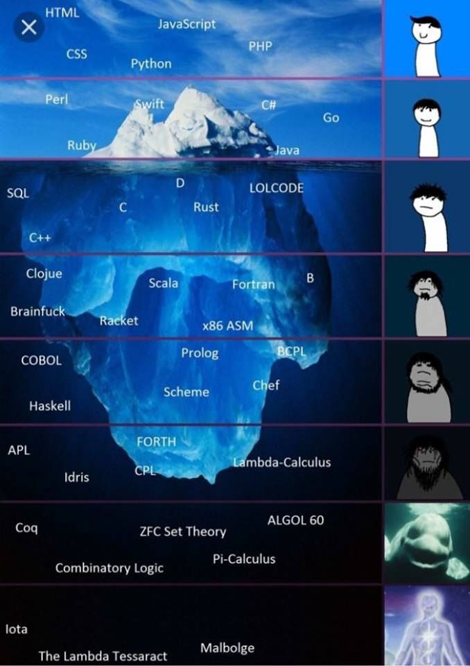
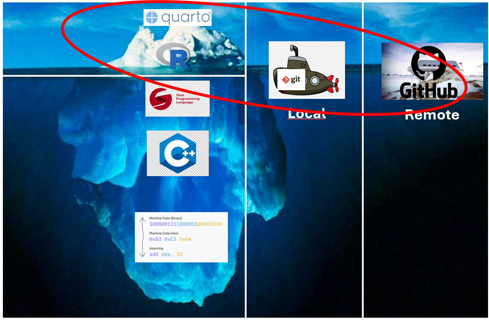
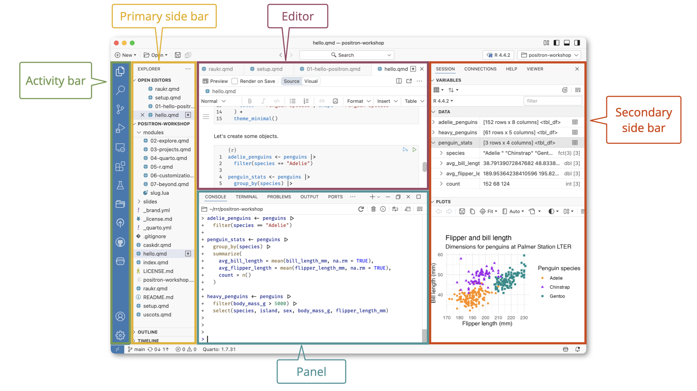

<!-- Shared format options live in _metadata.yml, so this deck's YAML carries only the title.

     THE DATA IN THIS DECK COMES FROM A CSV IN data/, exported from the week 1 Google Form by
     hand. Two files, and the first one that exists wins:

       data/week01-survey.local.csv   the real responses. Git-ignored, and refused by the
                                      pre-commit hook, because this repo is public and a
                                      cohort of nine leaves free-text answers.
       data/week01-survey.csv         test replies, committed, so the deck renders anywhere.

     During the session: render the deck beforehand, then while the room is on the
     "While you fill that in" section, open the form's response sheet, download it as CSV,
     save it as data/week01-survey.local.csv and render again. Everything from
     "Who is in the room" onward then shows the room.

     The QR slide comes early on purpose. Everything from "Who is in the room" onward runs
     on what the room enters there, so the responses need the whole counting-and-noise
     segment as a head start. The concept figures in that segment are SIMULATED, so they
     draw whether or not anyone has answered yet.

     Before the session:  quarto render slides/week01.qmd
     For the live run, generate the script and open it in Positron:

         knitr::purl(
           here::here("website", "slides", "week01.qmd"),
           output = here::here("website", "slides", "week01-live.R"),
           documentation = 1
         )
-->

```{r}
#| label: setup
#| include: false

start_time <- Sys.time()

library(tidyverse) # wrangling and visualization
library(here) # project-root-relative paths
library(ggpubr) # theme_pubr()
library(brms) # Bayesian regression via Stan

# website/_quarto.yml is itself a project-root marker, so a bare here() would stop at
# website/ rather than the repo root. i_am() anchors it explicitly. See STYLE.md section 4.
here::i_am("website/slides/week01.qmd")

# Shared palette. Reused verbatim across slides, homework and solutions so a
# chain colour means the same thing in every artefact of the course.
col_1 <- "steelblue"
col_2 <- "#E07B39"
col_3 <- "#7B3F9E"
col_4 <- "goldenrod3"
chain_cols <- c(col_1, col_2, col_3, col_4)
```

```{r}
#| label: read-survey
#| include: false

# The real responses if they are on this machine, the committed test replies otherwise.
# See the comment at the top of this file for how the local export gets here.
survey_csv <- here("website", "slides", "data", "week01-survey.local.csv")
if (!file.exists(survey_csv)) {
  survey_csv <- here("website", "slides", "data", "week01-survey.csv")
}

# Everything as character. We parse each column deliberately below rather than letting the
# reader guess.
raw <- read_csv(survey_csv, col_types = cols(.default = col_character()))
```

```{r}
#| label: tidy-survey
#| include: false

# Google Sheets uses the FULL QUESTION TEXT as each column header, so the first real
# wrangling of this course is giving those columns names you can type. Match on a short
# distinctive fragment rather than the whole sentence, so that rewording a question in the
# form does not silently break the deck.
fragments <- c(
  submitted = "^(timestamp|zeitstempel)$",
  major = "primary field of study",
  minor = "secondary field of study",
  semester = "semester of your bachelor",
  prior_courses = "taken a statistics or quantitative methods course",
  why_here = "register for this course",
  feeling = "how you feel about quantitative methods",
  heard_of = "tools have you heard of",
  worked_with = "tools have you worked with",
  conf_stats = "confidence in reading",
  conf_code = "confidence in working with code",
  comment = "anything else you would like me to know"
)

short_name <- function(nm) {
  hits <- names(fragments)[vapply(
    fragments,
    function(f) str_detect(nm, regex(f, ignore_case = TRUE)),
    logical(1)
  )]
  if (length(hits) == 1) hits else NA_character_
}

survey <- raw |>
  rename_with(~ coalesce(map_chr(.x, short_name), .x))

# Fail loudly and early. A rename that half worked would surface as an empty figure in
# front of the room, which is the one failure mode worth spending five lines to prevent.
missing_cols <- setdiff(names(fragments), names(survey))
if (length(missing_cols) > 0) {
  stop(
    "Survey columns not found after renaming: ",
    paste(missing_cols, collapse = ", "),
    ".\nThe form wording has probably changed. Update `fragments` in the tidy-survey chunk."
  )
}

# Parse the columns we actually model. Everything else stays character and is ordered by
# frequency where it is plotted, so the deck never hardcodes an answer option.
survey <- survey |>
  mutate(
    semester = as.integer(semester),
    conf_stats = as.integer(conf_stats),
    conf_code = as.integer(conf_code)
  )

n_responses <- nrow(survey)
n_missing_conf <- sum(is.na(survey$conf_stats))
```

```{r}
#| label: tidy-grids
#| include: false

# A Forms grid arrives as one column per row of the grid, named
# "<question text> [<row label>]". Pull the label out of the brackets instead of writing
# down the row wording, which keeps this working when the items are edited.
likert_levels <- c(
  "Strongly disagree",
  "Disagree",
  "Neither agree nor disagree",
  "Agree",
  "Strongly agree"
)

grid_long <- function(df, question_fragment, wrap = 30) {
  df |>
    select(matches(regex(question_fragment, ignore_case = TRUE))) |>
    pivot_longer(everything(), names_to = "item", values_to = "answer") |>
    mutate(
      item = str_extract(item, "\\[(.*)\\]", group = 1),
      item = str_wrap(item, width = wrap),
      # Sentence case first, so "Strongly Agree" and "Strongly agree" are one level.
      answer = factor(str_to_sentence(answer), levels = likert_levels)
    ) |>
    filter(!is.na(answer))
}

beliefs_long <- grid_long(survey, "how much do you agree with each statement")
reading_long <- grid_long(survey, "attending a political debate")

# The two checkbox questions arrive as one comma-separated string per respondent.
tools_long <- survey |>
  select(heard_of, worked_with) |>
  mutate(respondent = row_number()) |>
  pivot_longer(
    c(heard_of, worked_with),
    names_to = "level",
    values_to = "tool"
  ) |>
  separate_longer_delim(tool, delim = ", ") |>
  filter(!is.na(tool), tool != "") |>
  mutate(
    level = case_match(
      level,
      "heard_of" ~ "Heard of it",
      "worked_with" ~ "Worked with it"
    )
  )
```

```{r}
#| label: sim-concepts
#| include: false

# The counting, noise and inference figures are SIMULATED, not survey data. They run
# before anyone has answered, and they are the only place in this deck where the truth
# is known, which is exactly what makes them teachable.

# Forty invented people, one yes-or-no question.
set.seed(2026)
counting <- tibble(answer = c(rep("Agree", 26), rep("Disagree", 14)))

# Twelve rooms of nine, drawn from ONE unchanging world where half of everyone agrees.
set.seed(2026)
rooms <- tibble(room = 1:12, agree = rbinom(12, size = 9, prob = 0.5))

# Two nine-person datasets on the scales the survey uses. Panel A has a real slope of
# 0.45 scale points per semester. Panel B has a slope of exactly zero. The seed is fixed
# because it produces the instructive case: the eye reads a trend in the panel that has
# none, and reads nothing in the panel that has one.
set.seed(2118)
sem_sim <- c(3, 3, 4, 4, 5, 5, 6, 7, 8)
conf_a <- round(pmin(
  10,
  pmax(1, 4.5 + 0.45 * (sem_sim - 5) + rnorm(9, 0, 1.6))
))
conf_b <- round(pmin(
  10,
  pmax(1, 5.5 + 0.00 * (sem_sim - 5) + rnorm(9, 0, 1.6))
))

two_panels <- bind_rows(
  tibble(panel = "A", semester = sem_sim, confidence = conf_a),
  tibble(panel = "B", semester = sem_sim, confidence = conf_b)
)
```

## Welcome {#sec-welcome}

Quantitative Methods in International Relations.

- One session a week, and one homework a week.
- By the end you can take a dataset and a question and answer it responsibly, in code that
  anyone else can rerun.
- Today you see the whole thing once, end to end, on data about this room.

::: notes
Warm and short. The promise in the third bullet is the one to make out loud.
:::

## About me {#sec-about-me}

- Tristan Muno, Department of Political Science.
- I work on international relations, and I spend most of my time in R.
- Office hours by appointment, and email gets a reply within a day.

::: notes
Two minutes maximum.
:::

## About you {#sec-about-you}

I do not know any of that yet.

- Which subjects you come from.
- What you have already done with numbers, and what you have not.
- How you feel about being in this room.

. . .

So the first thing we do today is measure it.

::: notes
Say the last line and go straight to the next slide. Do not elaborate.
:::

## The survey, now {#sec-survey}

Please fill this in now. It takes about five minutes.

[forms.gle/kkvtRQXW5UJMoWq1A](https://forms.gle/kkvtRQXW5UJMoWq1A)

{width="230" fig-alt="QR code linking to the week 1 welcome survey."}

::: notes
Say nothing else until most people are typing.
Mention that it is anonymous and that the free-text box is read by you only.
Then start the next section while they finish. Do not wait for the last person.
:::


# While you fill that in {#sec-foundations}

::: notes
This whole section is simulated data. Nothing here waits on the survey.
:::

## Statistics is counting {#sec-counting .smaller}

```{r}
#| label: fig-counting
#| fig-cap: "Forty invented people answering one yes-or-no question. Twenty six agreed, so
#|   the proportion is 0.65, and that number is nothing more mysterious than one count
#|   divided by another."
#| fig-height: 3.2
#| dpi: 500
#| echo: false

counting |>
  count(answer) |>
  ggplot(aes(x = answer, y = n)) +
  geom_col(fill = "white", colour = col_1, width = 0.5) +
  geom_text(aes(label = n), vjust = -0.4, colour = col_1, size = 7) +
  scale_y_continuous(expand = expansion(mult = c(0, 0.18))) +
  theme_pubr() +
  labs(
    x = NULL,
    y = "How many people",
    title = "Forty people, one question, two piles"
  )
```

. . .

Sort things into piles, count the piles, divide.
Everything else in this course is built on top of that one move.

::: notes
Make the point that they can already do statistics. What they cannot yet do is the next
slide.
:::

## The same world, twelve different rooms {#sec-noise .smaller}

```{r}
#| label: fig-noise
#| fig-cap: "Twelve rooms of nine people, all drawn from one unchanging world in which
#|   exactly half of everyone agrees. The counts run from 1 to 6 anyway. The dashed line is
#|   the truth that generated all twelve."
#| fig-height: 3.2
#| dpi: 500
#| echo: false

ggplot(rooms, aes(x = factor(room), y = agree)) +
  geom_col(fill = "white", colour = col_2, width = 0.6) +
  geom_hline(
    yintercept = 4.5,
    linetype = "dashed",
    colour = col_1,
    linewidth = 0.8
  ) +
  annotate(
    "text",
    x = 0.7,
    y = 8.4,
    label = "the truth: half of everyone agrees",
    colour = col_1,
    hjust = 0,
    size = 4.2
  ) +
  scale_y_continuous(breaks = 0:9, limits = c(0, 9)) +
  theme_pubr() +
  labs(
    x = "Room",
    y = "How many agree",
    title = "Twelve rooms, nine people each, one world"
  )
```

::: notes
Point at room 11. One person in nine agreed, out of a world where half of everyone does.
Ask what they would have concluded if room 11 were the only room they ever saw.
:::

## Signal and noise {#sec-signal-noise .smaller}

The count moved.
The world did not.

. . .

- **Noise** is everything that moves the number without the world changing.
- **Signal** is what the world is actually doing.

. . .

You get **one** room.
Telling the two apart from one room is the entire problem, and every technique in this
course exists to attack it.

::: notes
This is the sentence the course hangs on. Say it slowly.
:::

## Which of these is real? {#sec-signal-or-noise .smaller}

```{r}
#| label: fig-signal-or-noise
#| fig-cap: "Two invented cohorts of nine students each, confidence against semester. In one
#|   panel confidence really does rise with semester, and in the other the true association
#|   is exactly zero. The panels are shown before the answer is given."
#| fig-height: 3.3
#| dpi: 500
#| echo: false

ggplot(two_panels, aes(x = semester, y = confidence)) +
  geom_point(colour = col_1, size = 3, alpha = 0.85) +
  facet_wrap(~panel) +
  scale_x_continuous(breaks = 3:8) +
  scale_y_continuous(breaks = seq(2, 10, 2), limits = c(1, 10)) +
  theme_pubr() +
  labs(
    x = "Semester",
    y = "Confidence, 1 to 10",
    title = "Nine students each, and one of these has a real trend in it"
  )
```

Hands up for A.
Hands up for B.

::: notes
Take the vote before clicking on. Most rooms pick B.
:::

## It was A {#sec-signal-reveal .smaller}

- **Panel A** was built with a real rise of 0.45 scale points per semester.
- **Panel B** was built with an association of exactly **zero**.

. . .

The panel that looks like a discovery is the one where nothing is happening.
The panel with the real effect looks like a mess.

. . .

::: {.callout-important}
**Nine observations are not enough for your eyes, and they are not enough for any method
either.**
No procedure can rescue information that the data does not contain.
What a good procedure can do is tell you honestly how little you have.
:::

::: notes
Do not soften this. It is the reason the interval at step 7 will be wide, and the reason a
wide interval is the correct answer rather than a failed demo.
:::

## Inferring about the unknown {#sec-unknown .smaller}

```{r}
#| label: fig-many-lines
#| fig-cap: "Panel B again, the nine students where the true association was zero, with 150
#|   candidate lines that the data cannot rule out. The dashed line is the truth. It is
#|   inside the fan, and so are a great many trends that are not there."
#| fig-height: 3.3
#| dpi: 500
#| echo: false

# Count the ways, on a grid. For every candidate line we ask how well it accounts for the
# nine points, and then sample lines in proportion to that. Same move as the two piles on
# the counting slide, one dimension up.
set.seed(2026)
candidates <- expand_grid(
  alpha = seq(2, 10, length.out = 120),
  beta = seq(-2, 2, length.out = 120)
) |>
  mutate(
    weight = exp(map2_dbl(
      alpha,
      beta,
      \(al, be) sum(dnorm(conf_b, al + be * (sem_sim - 5), 1.6, log = TRUE))
    ))
  )

picked <- candidates |>
  slice_sample(n = 150, weight_by = weight, replace = TRUE)

ggplot(
  tibble(semester = sem_sim, confidence = conf_b),
  aes(x = semester, y = confidence)
) +
  geom_abline(
    data = picked,
    aes(intercept = alpha - beta * 5, slope = beta),
    colour = col_3,
    alpha = 0.12,
    linewidth = 0.4
  ) +
  geom_hline(
    yintercept = 5.5,
    colour = col_2,
    linetype = "dashed",
    linewidth = 1
  ) +
  annotate(
    "text",
    x = 3,
    y = 1.6,
    label = "the truth, which you never get to see",
    colour = col_2,
    hjust = 0,
    size = 4.2
  ) +
  geom_point(colour = col_1, size = 3) +
  scale_x_continuous(breaks = 3:8) +
  scale_y_continuous(breaks = seq(2, 10, 2), limits = c(1, 10)) +
  theme_pubr() +
  labs(
    x = "Semester",
    y = "Confidence, 1 to 10",
    title = "Every line these nine points cannot rule out"
  )
```

> "Given these nine people, anything from a slight decline to a steep rise is still on the
> table."

::: notes
This picture is the whole course in one image, and it comes back as the posterior at
step 7.
The honest output of inference is the fan, not one line through the middle of it.
:::

# Who is in the room {#sec-room}

```{r}
#| label: fig-fields
#| fig-cap: "Primary and secondary fields of study in the room. Most of you share a major,
#|   which matters later: a group this homogeneous is not a sample of anything wider."
#| fig-height: 4
#| dpi: 500
#| echo: false

survey |>
  select(Major = major, Minor = minor) |>
  pivot_longer(everything(), names_to = "which", values_to = "field") |>
  filter(!is.na(field)) |>
  ggplot(aes(y = fct_rev(fct_infreq(field)))) +
  geom_bar(fill = "white", colour = col_2, width = 0.6) +
  facet_wrap(~which) +
  theme_pubr() +
  labs(x = "Count", y = NULL, title = "Fields of study")
```

## How far along, and what you have done before {#sec-background .smaller}

```{r}
#| label: fig-semester
#| fig-cap: "Current semester and previous exposure to quantitative methods. The semester
#|   panel is the predictor in the analysis we are about to run, so how much it varies
#|   decides how much this data can possibly tell us."
#| fig-height: 3.6
#| dpi: 500
#| echo: false

p_sem <- survey |>
  filter(!is.na(semester)) |>
  ggplot(aes(x = factor(semester))) +
  geom_bar(fill = "white", colour = col_1, width = 0.6) +
  theme_pubr() +
  labs(x = "Semester", y = "Count", title = "Which semester")

p_prior <- survey |>
  filter(!is.na(prior_courses)) |>
  ggplot(aes(y = fct_rev(fct_infreq(prior_courses)))) +
  geom_bar(fill = "white", colour = col_1, width = 0.6) +
  theme_pubr() +
  labs(x = "Count", y = NULL, title = "Methods courses before this one")

ggarrange(p_sem, p_prior, ncol = 2)
```

::: notes
Point at the semester panel and ask the room to notice how narrow it is.
Do not resolve it yet. It comes back at step 8.
:::

## Why you are here, and how you feel about it {#sec-why-here .smaller}

```{r}
#| label: fig-why-feeling
#| fig-cap: "Reasons for registering, and current feelings about quantitative methods.
#|   Nervousness in the room is normal and it is information, not a verdict."
#| fig-height: 3.6
#| dpi: 500
#| echo: false

p_why <- survey |>
  filter(!is.na(why_here)) |>
  ggplot(aes(y = fct_rev(fct_infreq(why_here)))) +
  geom_bar(fill = "white", colour = col_2, width = 0.6) +
  theme_pubr() +
  labs(x = "Count", y = NULL, title = "Why this course")

p_feel <- survey |>
  filter(!is.na(feeling)) |>
  ggplot(aes(y = fct_rev(fct_infreq(feeling)))) +
  geom_bar(fill = "white", colour = col_2, width = 0.6) +
  theme_pubr() +
  labs(x = "Count", y = NULL, title = "How you feel right now")

ggarrange(p_why, p_feel, ncol = 2)
```

::: notes
If the nervous bars are tall, say plainly that this is the normal starting point and that
the course is built for it.
:::

## Tools {#sec-tools .smaller}

```{r}
#| label: fig-tools
#| fig-cap: "Tools the room has heard of, against tools the room has actually used. The gap
#|   between the two bars is roughly what this course is for."
#| fig-height: 4
#| dpi: 500
#| echo: false

tools_long |>
  count(tool, level) |>
  ggplot(aes(
    x = n,
    y = fct_rev(fct_reorder(tool, n, .fun = sum)),
    fill = level
  )) +
  geom_col(position = position_dodge(width = 0.75), width = 0.7) +
  scale_fill_manual(
    values = c("Heard of it" = col_1, "Worked with it" = col_2)
  ) +
  theme_pubr() +
  labs(
    x = "Count",
    y = NULL,
    fill = NULL,
    title = "Heard of, against worked with"
  )
```

::: notes
Find one tool nobody has used and say we will use it in week 2.
:::

## How confident do you feel? {#sec-confidence .smaller}

```{r}
#| label: fig-confidence
#| fig-cap: "Self-rated confidence in reading statistical results and in working with code,
#|   both on a 1 to 10 scale. The left panel is the outcome of the analysis that follows."
#| fig-height: 3.6
#| dpi: 500
#| echo: false

survey |>
  select(Statistics = conf_stats, Code = conf_code) |>
  pivot_longer(everything(), names_to = "domain", values_to = "confidence") |>
  filter(!is.na(confidence)) |>
  ggplot(aes(x = confidence)) +
  geom_bar(fill = "white", colour = col_3, width = 0.6) +
  facet_wrap(~domain) +
  scale_x_continuous(breaks = 1:10, limits = c(0.5, 10.5)) +
  theme_pubr() +
  labs(
    x = "Confidence, 1 to 10",
    y = "Count",
    title = "Where you think you are now"
  )
```

::: notes
Say that we will come back to this exact number at the end of term.
:::

## What you already think about evidence {#sec-beliefs .smaller}

```{r}
#| label: fig-beliefs
#| fig-cap: "Agreement with six statements about what statistical evidence can do. These
#|   are the questions the whole course is an answer to, so the split in the room is the
#|   point rather than a problem."
#| fig-height: 4
#| dpi: 500
#| echo: false

ggplot(beliefs_long, aes(x = answer)) +
  geom_bar(fill = "white", colour = col_4, width = 0.6) +
  facet_wrap(~item, ncol = 3) +
  scale_x_discrete(labels = function(x) str_wrap(x, width = 10), drop = FALSE) +
  theme_pubr() +
  theme(axis.text.x = element_text(size = 6)) +
  labs(x = NULL, y = "Count", title = "What evidence can and cannot do")
```

::: notes
Read out the "a single result can prove a theory" panel.
That is the belief this course is going to take apart.
:::

## What you look for in a result {#sec-reading .smaller}

```{r}
#| label: fig-reading
#| fig-cap: "What the room says it attends to when reading a quantitative claim. Keep an eye
#|   on the significance panel against the uncertainty panel, because the next half hour is
#|   an argument for the second one."
#| fig-height: 4
#| dpi: 500
#| echo: false

ggplot(reading_long, aes(x = answer)) +
  geom_bar(fill = "white", colour = col_4, width = 0.6) +
  facet_wrap(~item, ncol = 3) +
  scale_x_discrete(labels = function(x) str_wrap(x, width = 10), drop = FALSE) +
  theme_pubr() +
  theme(axis.text.x = element_text(size = 6)) +
  labs(x = NULL, y = "Count", title = "Reading a quantitative claim")
```

::: notes
This is the bridge into the analysis. Whatever the room says here, the workflow answers with
an interval rather than a verdict.
:::

# A whole analysis, in eight steps {#sec-analysis}

## The 8-step workflow {#sec-workflow .smaller}



::: notes
Show the whole skeleton now.
Do not explain the steps. Promise that we run all eight in the next half hour.
Each later week deepens one or two of them.
:::

## This is the exam {#sec-this-is-the-exam}

- The eight steps are not a checklist for today.
- They are the shape of the take-home exam, and of every homework on the way there.
- **This is the exam.** Not a surprise at the end, but the target, from day one.

::: notes
Say the last bullet out loud. It reframes everything that follows.
:::

## The question {#sec-question}

> Do students become more confident in statistics as they progress through their studies?

We have exactly what we need to try: a **semester** for each of you, and a **confidence**
score for each of you.

::: notes
Flag this as a deliberately small question, chosen because it fits in half an hour.
The point is the procedure, not the finding.
:::

## Step 1: name the quantity {#sec-estimand .smaller}

**The average difference in self-rated statistical confidence, in scale points, associated
with being one semester further along.**

. . .

- It names a **quantity**, not a test, and it comes with a **unit**.
- It is written down **before** any model exists.
- It says **associated with**, not **caused by**.

. . .

> "I want one number, in scale points per semester, and I am committing to that target
> before I look at anything."

::: notes
Insist on the unit. "More confident" is not an estimand. "0.4 scale points per semester" is.
:::

## Step 1: what this can never be {#sec-estimand-causal .smaller}

::: {.callout-important}
**Nothing in this analysis licenses a causal claim.**
Nobody was assigned a semester, so we are comparing different people, not following one
person through their degree.
Causal identification is a separate course.
:::

. . .

> "Later-semester students report different confidence" is a finding.
> "Studying longer makes you more confident" is not, and no amount of computation turns the
> first sentence into the second.

::: notes
Students reach for the causal sentence by reflex. Correct it here, once, hard, so that the
correction is available all term.
:::

## Step 2: look at the data {#sec-data-summary .smaller}

```{r}
#| label: fig-scatter
#| fig-cap: "Self-rated statistical confidence against current semester, one point per
#|   respondent. Points are nudged sideways so that overlapping answers stay visible."
#| fig-height: 3.3
#| dpi: 500
#| echo: false

model_df <- survey |>
  filter(!is.na(conf_stats), !is.na(semester)) |>
  mutate(semester_c = semester - 5)

set.seed(2026)
ggplot(model_df, aes(x = semester, y = conf_stats)) +
  geom_jitter(
    width = 0.12,
    height = 0.12,
    colour = col_1,
    size = 3,
    alpha = 0.8
  ) +
  scale_y_continuous(breaks = 1:10, limits = c(1, 10)) +
  theme_pubr() +
  labs(
    x = "Semester",
    y = "Confidence, 1 to 10",
    title = "Every response we are going to model"
  )
```

> "This is the same picture as panel A and panel B, and this time nobody knows the answer."

## Step 2: say what the data is, out loud {#sec-data-honest .smaller}

```{r}
#| label: data-facts
#| echo: false
#| results: asis

cat(sprintf(
  "- **%d** responses, of which **%d** left the confidence question blank.\n- **%d** rows go into the model.\n- Semester runs from **%d** to **%d**.\n- Confidence runs from **%d** to **%d** on a 1 to 10 scale.\n",
  n_responses,
  n_missing_conf,
  nrow(model_df),
  min(model_df$semester),
  max(model_df$semester),
  min(model_df$conf_stats),
  max(model_df$conf_stats)
))
```

::: {.callout-warning}
**The confidence question was the only optional one in the survey.**
Blank answers are dropped here, and dropping them is a decision that deserves a sentence in
any writeup rather than a silent filter.
:::

::: notes
Read the semester range out. If it is one or two values wide, say so now and promise the
consequence at step 8.
:::

## Step 3: the model is a picture first {#sec-model .smaller}

```{r}
#| label: fig-model-shape
#| fig-cap: "The shape we are about to assume, drawn on invented data. A straight line for
#|   the average confidence at each semester, and a band showing how far individual people
#|   scatter around that average."
#| fig-height: 3.1
#| dpi: 500
#| echo: false

set.seed(2026)
shape_line <- tibble(semester = seq(3, 8, length.out = 60)) |>
  mutate(mu = 5 + 0.35 * (semester - 5), lo = mu - 3, hi = mu + 3)

shape_points <- tibble(semester = runif(45, 3, 8)) |>
  mutate(confidence = 5 + 0.35 * (semester - 5) + rnorm(45, 0, 1.5))

ggplot(shape_line, aes(x = semester)) +
  geom_ribbon(aes(ymin = lo, ymax = hi), fill = col_1, alpha = 0.12) +
  geom_line(aes(y = mu), colour = col_1, linewidth = 1.1) +
  geom_point(
    data = shape_points,
    aes(y = confidence),
    colour = col_2,
    size = 2,
    alpha = 0.7
  ) +
  annotate(
    "text",
    x = 3,
    y = 9.2,
    label = "the band: how much people differ",
    colour = col_1,
    hjust = 0,
    size = 4
  ) +
  annotate(
    "text",
    x = 5.6,
    y = 2.2,
    label = "the line: the average at each semester",
    colour = col_1,
    hjust = 0,
    size = 4
  ) +
  scale_x_continuous(breaks = 3:8) +
  scale_y_continuous(limits = c(1, 10)) +
  theme_pubr() +
  labs(
    x = "Semester",
    y = "Confidence, 1 to 10",
    title = "A line for the average, a band for the spread"
  )
```

> "People at the same semester do not all answer the same, and I expect the average to move
> in a straight line."

## Step 3: the same picture in symbols {#sec-model-notation .smaller}

$$
\text{confidence}_i \sim \text{Normal}(\mu_i,\ \sigma), \qquad
\mu_i = \alpha + \beta\,(\text{semester}_i - 5)
$$ {#eq-model}

::: {.small}
- $\alpha$ is the height of the line at **semester 5**, because that is where we centred it.
- $\beta$ is the tilt of the line, which is the estimand from step 1.
- $\sigma$ is the width of the band, which is how much people differ at the same semester.
:::

. . .

::: {.callout-warning}
**Treating a 1 to 10 scale as a number is a choice, not a fact.**
It assumes the step from 3 to 4 is the same size as the step from 8 to 9.
We are doing it on purpose, and we come back to it at step 8.
:::

::: notes
Three symbols, three parts of the picture they just saw. Do not linger.
Centring is the one piece of technique worth a sentence: without it alpha would describe a
semester-zero student, which nobody is.
:::

## Step 3: the priors, drawn {#sec-priors .smaller}

```{r}
#| label: fig-priors
#| fig-cap: "The three priors as pictures. Each curve says how plausible I find each value
#|   of that quantity before seeing a single answer, and the shaded region on the middle
#|   panel holds 95 percent of that belief."
#| fig-height: 2.7
#| dpi: 500
#| echo: false

prior_curves <- bind_rows(
  tibble(
    par = "Where the average sits",
    x = seq(-1, 12, length.out = 400),
    d = dnorm(x, 5.5, 2)
  ),
  tibble(
    par = "The association, per semester",
    x = seq(-4, 4, length.out = 400),
    d = dnorm(x, 0, 1)
  ),
  tibble(
    par = "How much people differ",
    x = seq(0, 12, length.out = 400),
    d = dexp(x, 0.5)
  )
) |>
  mutate(par = fct_inorder(par))

prior_shade <- prior_curves |>
  filter(par == "The association, per semester", x >= -2, x <= 2)

ggplot(prior_curves, aes(x = x, y = d)) +
  geom_area(data = prior_shade, fill = col_3, alpha = 0.18) +
  geom_line(colour = col_3, linewidth = 0.8) +
  facet_wrap(~par, scales = "free", ncol = 3) +
  theme_pubr() +
  theme(
    axis.text.y = element_blank(),
    axis.ticks.y = element_blank(),
    axis.line.y = element_blank()
  ) +
  labs(
    x = "Scale points",
    y = NULL,
    title = "What I am willing to believe before seeing any answer"
  )
```

> "My expectation before the data is that the association is most likely 0, but it may be
> positive or negative, with 95 percent certainty between -2 and +2 scale points per
> semester."

::: notes
Read the quote off the middle panel while pointing at the shaded region.
Priors are commitments, not conveniences. Centring beta on zero is the honest starting
point, not a trick to get a null.
:::

## Step 4: do those beliefs imply sane data? {#sec-prior-predictive .smaller}

```{r}
#| label: fig-prior-predictive
#| fig-cap: "One thousand datasets simulated from the priors alone, before any response was
#|   used. Most simulated answers land inside the 1 to 10 scale, which is what we want, but
#|   the dashed lines show that the model is also willing to predict impossible scores."
#| fig-height: 3.1
#| dpi: 500
#| echo: false

set.seed(2026)
n_sim <- 1000

prior_draws <- tibble(
  alpha = rnorm(n_sim, mean = 5.5, sd = 2),
  beta = rnorm(n_sim, mean = 0, sd = 1),
  sigma = rexp(n_sim, rate = 0.5)
) |>
  mutate(
    # A fifth-semester student, so the beta term drops out, and a ninth-semester one.
    sem_5 = rnorm(n_sim, mean = alpha, sd = sigma),
    sem_9 = rnorm(n_sim, mean = alpha + beta * 4, sd = sigma)
  ) |>
  select(sem_5, sem_9) |>
  pivot_longer(everything(), names_to = "who", values_to = "confidence") |>
  mutate(who = case_match(who, "sem_5" ~ "Semester 5", "sem_9" ~ "Semester 9"))

ggplot(prior_draws, aes(x = confidence)) +
  geom_histogram(bins = 40, fill = "white", colour = col_3, linewidth = 0.3) +
  geom_vline(xintercept = c(1, 10), linetype = "dashed", colour = col_2) +
  facet_wrap(~who) +
  theme_pubr() +
  labs(
    x = "Simulated confidence",
    y = "Count",
    title = "What the priors alone predict"
  )
```

> "Before touching anyone's answers, my beliefs already imply students with a confidence of
> 12, which is not a thing that exists."

::: notes
This is the step people skip and the step that catches bad priors.
Point at the dashed lines. Keep the consequence for step 8.
:::

## Step 5: let the computer do the counting {#sec-fit .smaller}

```{r}
#| label: fit-model
#| output: false

priors <- c(
  prior(normal(5.5, 2), class = "Intercept"),
  prior(normal(0, 1), class = "b"),
  prior(exponential(0.5), class = "sigma")
)

fit <- brm(
  conf_stats ~ semester_c,
  data = model_df,
  family = gaussian(),
  prior = priors,
  chains = 4,
  iter = 2000,
  seed = 2026,
  refresh = 0,
  file = here("website", "slides", "data", "week01-fit"),
  file_refit = "on_change"
)
```

This is the fan of lines from earlier, done properly.
The computer tries thousands of candidate lines and keeps each one in proportion to how well
it accounts for your answers.

. . .

> "I am not asking for the best line. I am asking which lines survive contact with the
> data."

::: notes
Run this live and talk over the compile. R writes Stan, Stan writes C++, the compiler builds
a sampler specific to this model.
That wait is the reason week 7 exists.
:::

## Step 6a: did the counting work? {#sec-diagnostics .smaller}

```{r}
#| label: fig-trace
#| fig-cap: "Trace plots for the three parameters. Four searches started in different places
#|   and ended up wandering around the same region, which is what a working computation looks
#|   like. A line drifting off on its own would be the warning sign."
#| fig-height: 3.2
#| dpi: 500
#| echo: false

mcmc_plot(fit, type = "trace") +
  scale_colour_manual(values = chain_cols) +
  theme_pubr()
```

> "Four independent searches agree with each other, so the arithmetic is trustworthy. That
> is a statement about the computer, not about whether the model is any good."

::: notes
Say the second sentence of the quote twice. Students routinely read convergence as evidence
that the model is correct.
:::

## Step 6a: the numbers behind that picture {#sec-diagnostics-numbers .smaller}

```{r}
#| label: tbl-diagnostics
#| tbl-cap: "Convergence diagnostics. R-hat at 1.00 and effective sample sizes in the
#|   thousands mean the sampler did its job. This says nothing about whether the model is
#|   a good model."
#| echo: false

posterior::summarise_draws(fit, "rhat", "ess_bulk", "ess_tail") |>
  filter(str_detect(variable, "^b_|^sigma")) |>
  knitr::kable(digits = 2)
```

> "R-hat sits at 1.00, so the four searches ended up in the same place, and there are
> thousands of usable draws to summarise."

::: notes
One line each. R-hat near 1 means the chains agree, ESS is how many independent draws the
correlated ones are worth. Details in week 7.
:::

## Step 6b: can the model reproduce your answers? {#sec-ppc .smaller}

```{r}
#| label: fig-ppc
#| fig-cap: "Posterior predictive check. The dark line is the confidence we actually
#|   observed, the pale lines are datasets the fitted model generates. Where they disagree
#|   is where the model is wrong about the world."
#| fig-height: 3.2
#| dpi: 500
#| echo: false

set.seed(2026)
pp_check(fit, ndraws = 50) +
  theme_pubr()
```

> "The model invents smooth answers where you gave me ten whole numbers, so it is already
> wrong in a way I can see and name."

::: notes
Expect the model to over-smooth: it predicts a continuous bell where the data is ten
discrete steps. Name that. It is honest and it previews week 11.
:::

## Step 7: what is the answer? {#sec-interpretation .smaller}

```{r}
#| label: answer
#| echo: false
#| results: asis

b <- as_draws_df(fit)$b_semester_c
q <- quantile(b, probs = c(0.05, 0.5, 0.95))

cat(sprintf(
  "Each additional semester is associated with a change of **%.2f** scale points of confidence,\nwith a 90 percent credible interval from **%.2f** to **%.2f**.\n\nThe posterior puts **%.0f percent** of its mass above zero.\n",
  q[2],
  q[1],
  q[3],
  100 * mean(b > 0)
))

# The quoted reading has to stay true whatever the room turns out to look like, so it is
# built from the interval rather than written down in advance.
reading <- if (q[1] <= 0 && q[3] >= 0) {
  sprintf(
    "> \"Anything between %.2f and %.2f scale points per semester is consistent with what you told me, and that range includes no association at all. I cannot tell which it is, and saying there is no association would be going further than the data allows.\"\n",
    q[1],
    q[3]
  )
} else {
  sprintf(
    "> \"Anything between %.2f and %.2f scale points per semester is consistent with what you told me, and no association at all is outside that range. With nine people I would report it and I would not lean on it.\"\n",
    q[1],
    q[3]
  )
}
cat("\n", reading, sep = "")
```

::: notes
Read the quote verbatim. This is the sentence the exam is graded on.
Never "proves", never "there is no effect", never "significant".
:::

## Step 7: the same answer, drawn {#sec-interpretation-plot .smaller}

```{r}
#| label: fig-posterior
#| fig-cap: "The posterior for the tilt of the line. This is the fan of candidate lines from
#|   the start of the session, collapsed onto its slope, and the width of the shape is the
#|   honest summary of how much this data settles the question."
#| fig-height: 3.2
#| dpi: 500
#| echo: false

mcmc_plot(fit, type = "areas", variable = "b_semester_c", prob = 0.9) +
  geom_vline(xintercept = 0, linetype = "dashed", colour = col_2) +
  theme_pubr() +
  labs(x = "Scale points of confidence per semester", y = NULL)
```

::: {.callout-note}
**An interval is the answer, not a decoration on it.**
A point estimate with no width attached is a claim the data cannot support.
:::

## Step 8: what this cannot tell us {#sec-limitations .smaller}

::: {.small}
- **Almost everyone here is in the same semester.** This is the nine-point problem from the
  start of the session, and no method fixes it.
- **There are nine of us.** That is a class, not a sample of any population.
- **Nobody was assigned a semester.** We compared different people, not one person over time.
- **Self-reported confidence is not skill.** It might even move the other way as you learn how
  much there is to know.
- **The Normal likelihood ignores the scale.** We saw it predict below 1 and above 10 at
  step 4, and the posterior predictive check at step 6b shows the same thing.
:::

::: notes
This is the punchline. A wide interval centred near zero is the correct answer here, not a
failed demo.
Being able to say why is the thing being graded on the exam.
:::

## That was all eight steps {#sec-recap}

- We named a quantity, drew a model, checked it, fitted it, criticised it, and said what we
  do not know.
- Every week from here deepens one or two of those steps.
- The exam is this, on a real dataset, written up properly.

::: notes
Point back at the workflow table. Everything on the schedule now has somewhere to attach.
:::

# How the course works {#sec-course}

## Everything lives on the website {#sec-website .smaller}

- **Schedule.** Every session, its slides, its homework, its solution, its reading.
- **Syllabus.** Goals per session, the workload arithmetic, and the exam rules.
- **Glossary.** Terms as they get introduced.
- **Installation.** Do this before week 2.

. . .

::: {.callout-important}
**If it is not linked from the website, it does not exist.**
There is no second channel, no handouts and no shared drive.
:::

## What you will learn {#sec-learn .smaller}

- How to build a reproducible, open-source research workflow, integrating data, code,
  analysis and writing into one transparent process.
- How to use statistical models to learn from data: what they assume, what they estimate,
  and how to interpret them responsibly.
- How to communicate empirical results clearly, through structured reports, figures and
  reproducible documents.

## What this course does not cover {#sec-not-cover .smaller}

- **Data collection and research design.** We work with existing datasets. The university has
  dedicated courses for survey design and measurement.
- **Causal inference.** We analyse and interpret associations rather than identify causes,
  which you saw me insist on at step 1.
- **Political theory.** The examples are political, but the training is methodological.

## Why the course is built this way {#sec-why-built}

{fig-alt="An iceberg, with a small part above the waterline."}

------------------------------------------------------------------------

{fig-alt="The iceberg labelled with programming skills, most of them below the waterline."}

------------------------------------------------------------------------

{fig-alt="The full course iceberg, showing everything under the visible result."}

## Homework {#sec-homework .smaller}

- Eleven assignments, one in every session except this one and the last.
- Each opens when its session ends and is due seven days later.
- The schedule links a template repo. Generate yours and name it exactly
  `hw-NN-<username>`.

. . .

<!-- The feedback-policy banner is reproduced VERBATIM wherever it appears
     (CLAUDE.md section 2, STYLE.md section 7). Do not reword it here. -->
::: {.callout-important}
**A sample solution is published for every homework. Individual feedback is NOT provided by
default.** The only individual feedback available is the **optional AI feedback** you can opt
into by adding an open-source `license.md` to your submission repo.
:::

## The exam {#sec-exam .smaller}

- A take-home analysis, opening as the last session ends and running for two weeks.
- A dataset, a research question, and the eight steps you just watched.
- You submit a repository that someone else can render, plus a PDF.

. . .

::: {.callout-note}
**You have now seen the entire shape of it.**
Nothing on the exam is a step this course did not spend a week on.
:::

# Where you will work {#sec-positron}

::: notes
If the clock has beaten you, stop here and open week 2 with this section.
Nothing later depends on finishing it today.
:::

## The Positron window {#sec-positron-layout .smaller}

{fig-alt="The Positron window with its regions labelled: Activity bar, Primary side bar, Editor, Panel, and Secondary side bar."}

::: notes
Have everyone open Positron and find the five labelled regions on their own screen.
Two minutes of everyone looking beats ten minutes of you describing.
:::

## Three places, and why they are different {#sec-panes .smaller}

**Editor.**
The main pane, where files are open for editing.
Writing code here and then running it is the normal way to work, because the Editor keeps a
record and the Console does not.

**Console.**
An R session waiting for R commands.
Anything that looks like R code, such as `install.packages("here")`, goes here.

**Terminal.**
A place to type commands to your operating system rather than to R.
Commands such as `git --version` go here, and running them in the Console produces an error.

. . .

::: {.callout-tip}
**A quick way to tell them apart.**
If the line starts with `>` you are in the R Console.
If it starts with your username, a folder name, or `PS C:\>`, you are in a Terminal.
:::

::: notes
This is the single most common source of week 2 confusion, so name it now.
The same three definitions are on the Installation page, worded the same way.
:::

## Next week {#sec-next-week}

- Install everything from the **Installation** page before the session.
- Send me your GitHub username.
- Week 2: Quarto, Git, and your first reproducible document.

::: notes
End here. Repeat the installation ask, it is the one thing that blocks week 2.
:::

```{r}
#| label: session-info
#| include: false

sessionInfo()
Sys.time() - start_time
```
