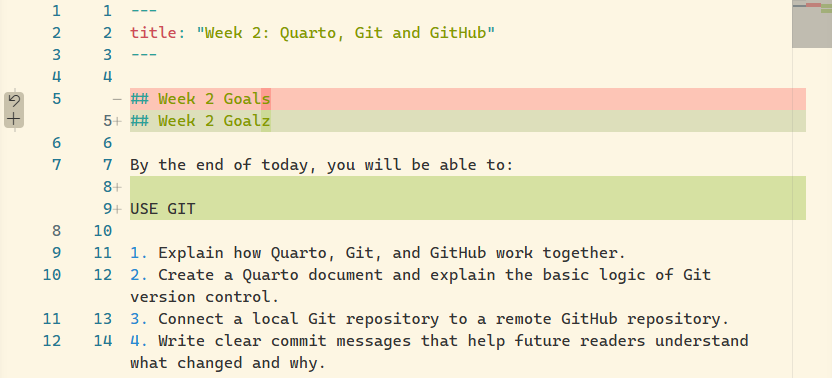

## Week 2 Goals {#sec-week02-goals}

By the end of today, you will be able to:

1. Explain how Quarto, Git, and GitHub work together.
2. Create a Quarto document and explain the basic logic of Git version control.
3. Connect a local Git repository to a remote GitHub repository.
4. Write clear commit messages that help future readers understand what changed and why.

## Today {#sec-today .smaller}

1. **Getting oriented in Positron**
   - Terminal, Console, folders, and working directories

2. **Quarto and literate programming**
   - From plain text to a reproducible document

3. **Version control with Git**
   - Tracking, reviewing, and committing changes

4. **GitHub**
   - Sharing and syncing your work

5. **Looking ahead**
   - Code cells and programming

6. **Wrap-up and practice**

# Positron: What is what? {#sec-positron}

## A quick tour of Positron {#sec-positron-tour .smaller}

{#fig-positron-layout}

- **Editor**: write and edit files
- **Terminal**: interact with your computer using commands
- **Console**: run R code
- **Explorer**: navigate files and folders
- **Source Control**: see and commit changes

## Terminal and Console are different {#sec-terminal-console}

::: {.columns}

:::: {.column width="50%"}

**Terminal**

Talks to your computer.

```text
$ ls
$ cd ..
$ clear
```

::::

:::: {.column width="50%"}

**Console**

Talks to R.

```r
1 + 1

mean(c(2, 4, 6))
```

::::

:::

**Key idea:** the terminal and the R console do different jobs.

## Where am I? {#sec-working-directory}

Your computer is organised into folders.

The terminal always has a **current working directory**.

```text
R/
└── Course/
    ├── week01/
    ├── week02/
    └── homework/
```

Commands act on files relative to where you are.

## A few terminal commands {#sec-terminal-commands}

| Command | What it does |
|---|---|
| `ls` | list files and folders |
| `cd folder` | move into a folder |
| `cd ..` | move up one folder |
| `cd .` | refer to the current folder |
| `clear` | clear the terminal |

The exact commands can differ slightly between operating systems.

## Practice: Find your course folder {#sec-practice-terminal .smaller}

**Do this now.**

1. Create a new folder called `R` or `Course`.
2. Put it somewhere on your computer that is **not** synced by iCloud, OneDrive, Dropbox, or another cloud service.
3. Open a terminal or PowerShell.
4. Navigate to your new folder manually.
5. Practise:
   - `ls`
   - `cd ..`
   - `cd .`
   - `clear`

**Goal:** know where you are before you start working.

## Positron can take care of this {#sec-positron-folders}

You do not always need to navigate manually.

When you **open a folder in Positron**, Positron can use that folder as the context for your work.

::: {.callout-tip}
### Tip
For this course, think in terms of **folders as projects**.

Open the folder you are working in, then work from there.
:::

# Quarto and literate programming {#sec-quarto}

## What is literate programming? {#sec-literate-programming}

Traditional programming separates:

- **code**
- **documentation**
- **results**

Literate programming [@knuth1984literate] brings them together.

> Explain what you are doing, show the code, and include the result in the same document.

This makes the analysis easier to **read, reproduce, and revise**.

## Quarto: a document that can be rendered {#sec-quarto-concept .smaller}

A Quarto document combines:

- **prose**
- **formatting**
- **code**
- **figures**
- **tables**
- **references**

A `.qmd` file is the source.

Quarto turns the source into a rendered document, for example HTML, PDF or Word documents

## From source to output {#sec-quarto-workflow}


**One source, different outputs.**

Extensive documentation at [quarto.org](https://quarto.org/)


::: {.callout-tip}
**Learn to search the documentation.**
When you get stuck, checking the official documentation is often the best place to start.
:::


## A first look at `.qmd` structure {#sec-quarto-glance .smaller}

:::: {.columns}
::: {.column width="50%"}
``` markdown
---
format: html
---

# Section header

## A subsection

*This sentence is written in italics.*
**This one is bold.**
Using backticks formats text to `look like code`.

[This is a hyperlink](www.uni-mannheim.de)
```
:::

::: {.column width="50%"}
### A Section {#sec-week02-demo-heading .unlisted}

#### A subsection {.unlisted}

*This sentence is written in italics.* **This one is bold.** Using backticks formats text to `look like code`.

[This is a hyperlink](https://www.uni-mannheim.de)
:::
::::

- **Q**uarto **M**ark**d**own (**`.qmd`**) files have two main parts:
  - **YAML header**: Contains metadata and controls how Quarto processes the document. It appears at the top of the file and is enclosed by `---`.
  - **Document body**: Contains the main content of the document.

## Practice: Build your first `.qmd` {#sec-quarto-practice}

**Create a new Quarto document.**

:::: {.columns}
::: {.column width="50%"}

Your document should contain:

- a title
- your name as author
- today's date
- a table of contents

:::

::: {.column width="50%"}

Then add some content:

- a short paragraph
- *italic text*
- **bold text**
- a block quote
- a bullet list
- a Markdown table

:::
::::

## Practice: Add a figure {#sec-quarto-figure}

Find an image on the web and save it into your course folder.

Add it to your Quarto document.

Give it:

- a caption
- a label

Then refer to it somewhere in your text.

For example:

```markdown
As shown in @fig-example, ...
```

## Practice: Change the output format {#sec-quarto-format}

Try rendering your document as:

- HTML
- PDF

What changes?

What stays the same?

## Two ways to render {#sec-quarto-render}

You can render from Positron:

**Preview**

Or from the terminal:

```bash
quarto render
```

Try both.

**What is the relationship between these two ways of working?**

# Version control with Git {#sec-git}

## Git: a change tracker {#sec-git-concept}

Git keeps track of changes to your files.

Think of it as a history of your work:

```text
version 1
    |
    v
version 2
    |
    v
version 3
    |
    v
version 4
```

You can inspect what changed and return to earlier versions.

## What does Git actually track? {#sec-git-diff .smaller}

Git compares versions of your files.



This is called a **diff**.

- A diff shows:
  - what was removed
  - what was added
  - what has changed and where

## Live demo: Positron's Source Control pane {#sec-git-positron .smaller}

Let's look at Git inside Positron.

We will:

1. Open the Source Control pane.
2. Initialize a repo
3. Change the `.qmd` file.
4. Inspect the diff.
5. Commit the change.
6. Look at the history.

## What is a commit? {#sec-git-commit}

A **commit** records a set of changes in the history of your repository.

A commit has:

- the changes
- who made them
- when they were made
- a commit message

Think of a commit as a meaningful checkpoint -- a snapshot of your project at a specific point in time.

## Commit messages {#sec-commit-messages .smaller}

Commit messages are for future readers (most importantly future you!)

A useful commit message answers:

**What changed?**

Good:

```text
Add figure and cross-reference to introduction
```

Less useful:

```text
Changes
```

Or:

```text
Update
```

Write the message for someone who may read the history later.


::: {.callout-note}
This also provides a transparent way to communicate which changes were made with the help of AI. More on this in the coming weeks.
:::


## Practice: Make some changes {#sec-git-practice}

Go back to your `.qmd` document.

1. Add or change some content.
2. Inspect the diff.
3. Commit your changes.
4. Make another change.
5. Commit again.
6. Inspect the history.

Notice how your document now has a record of its development.

## One sentence per line {#sec-one-sentence .smaller}

When writing prose in a `.qmd` file, consider putting **one sentence on each line**.

Instead of:

```text
This is one sentence. This is another sentence. Here is a third sentence.
```

write:

```text
This is one sentence.
This is another sentence.
Here is a third sentence.
```

The rendered document looks the same.

But Git can now show changes at the **sentence level**.

::: {.callout-tip}
### Tip
One sentence per line makes Git diffs much easier to read when you are revising prose.
:::

# GitHub in a nutshell {#sec-github}

## Git and GitHub are not the same thing {#sec-git-github}

**Git** is the version control system.

**GitHub** is a service for hosting and collaborating on Git repositories.

A useful mental model:

```text
your computer                  GitHub
-------------                  ------
local repository   <------>    remote repository
                     sync
```

## Push: send your commits to GitHub {#sec-git-push .smaller}

Your commits initially live in your **local repository**.

`git push` sends your commits to the remote repository on GitHub.

```text
local repository
       |
       | git push
       v
remote repository
       |
     GitHub
```

The reverse operation, `git pull`, brings changes from the remote repository into your local repository.

In Positron, the **Sync** button can help you perform this workflow.


::: {.callout-note}
`git push` won’t work right away in a new setup.
You first need to connect your GitHub account to Git once.
Then, for each project, connect the local repository to its remote repository on GitHub once.
:::


## Live demo: Local to GitHub {#sec-github-demo}

We will:

1. Look at the local Git repository.
2. Connect it to a GitHub repository.
3. Make a commit.
4. Push the commit.
5. Look at the result on GitHub.

The important idea is the relationship between **local** and **remote**.

# Sneak peek: Code cells and programming {#sec-code-cells}

## Quarto can contain code {#sec-quarto-code}

So far, we have used Quarto mainly for writing.

But a `.qmd` document can also contain executable code.

```{r}
#| label: demo-arithmetic
2 + 2
```

Quarto can run the code and include the result in the document.

## Back to literate programming {#sec-code-literate-programming}

Now we can bring the pieces together:

```text
prose
  +
code
  +
results
  +
figures
  +
tables
  =
one reproducible document
```

Next week, we start using **R** inside our Quarto documents.

# Summary {#sec-summary .smaller}

Today we:

- got oriented in Positron
- learned about working directories
- created a Quarto document
- explored literate programming
- rendered HTML and PDF
- used Git to track changes
- wrote and inspected commits
- connected Git to GitHub
- pushed changes to a remote repository

## The big picture {#sec-big-picture}

```text
             Quarto
        write + render
              =
        reproducible
          document
              |
              v
             Git
       track the changes
              |
              v
           GitHub
        share + sync
```

The three tools solve **different parts of the same workflow**.

# Practice and homework {#sec-practice-homework}

## If you have time today {#sec-week02-datacamp}

Start the **Introduction to R** course on DataCamp.

Focus on getting comfortable with the basic R environment and syntax.

## Homework {#sec-homework}

Practise creating and rendering a Quarto document.

Make sure you can:

- create a `.qmd` file
- add metadata
- use basic Markdown
- add a table
- add and label a figure
- render to HTML and PDF
- make and inspect a Git commit

## Next week {#sec-next-week}

**Introduction to R**

We will start putting code into our Quarto documents.

```{r}
#| label: session-info
#| include: false

sessionInfo()
```