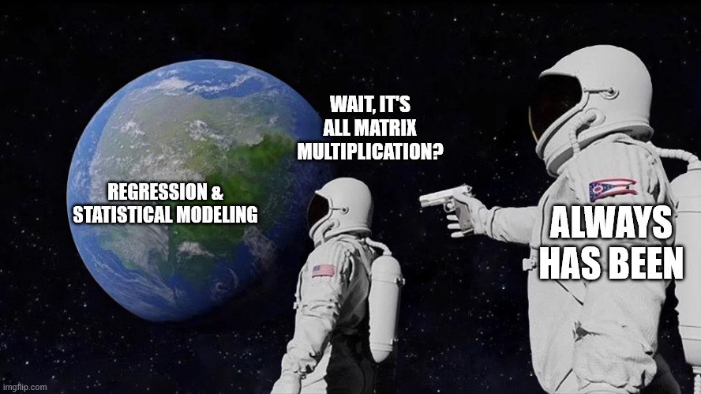

<!-- Shared format options live in _metadata.yml, so this deck's YAML carries only the title.

     This week teaches code, so the code has to be visible. _metadata.yml folds every chunk by
     default (code-fold: true), and a deck may not override that in its own YAML (E041), so each
     teaching chunk opts out with #| code-fold: false.

     Rhythm: every concept is followed by a "Practice:" slide the room does on the spot, as in
     week 02. Where a practice slide has an answer, it sits behind a . . . beat so it can be
     revealed after the room has tried. Base R only: no packages this week. -->

```{r}
#| label: setup
#| include: false

start_time <- Sys.time()
```

## Week 3 goals {#sec-week03-goals}

By the end of today, you will be able to:

1. Explain the core concepts: objects, functions and pipes.
2. Name the main data types R uses to store information.
3. Name the main data structures R uses to organise information.
4. Access and explore data using `[ ]` and `$`.
5. Read an error message and work out what R was actually asked to do.

## Today {#sec-today .smaller}

1. **Objects and functions**
   - Storing information, and doing things with it
2. **Reading errors**
   - What R is telling you when it refuses
3. **The pipe**
4. **Data types**
   - Numbers, text, true and false, categories, dates
5. **Data structures**
   - From a single value to a whole dataset
6. **Accessing and exploring data**

::: notes
Say it up front: today you type along.
Every idea is followed by a short practice slide, so keep Positron open with a fresh `.qmd` or an R console.
:::

# Objects and functions {#sec-objects-functions}

## Two slogans {#sec-two-slogans .smaller}

> To understand computations in R, two slogans are helpful:
> Everything that exists is an **object**.
> Everything that happens is a **function** call.
>
> John Chambers

- **Objects** are named containers holding information.
- **Functions** are operations that take objects and return new ones.
- **Pipes** chain several function calls into one readable sequence.

::: notes
This quote is the anchor for the whole session.
R has a very consistent grammar once these three ideas land.
:::

## Objects: storing information {#sec-objects .smaller}

:::: {.columns}

::: {.column width="50%"}
An object has:

- a **name**, how you refer to it
- a **value**, the information stored
- a **type**, what kind of information it is
:::

::: {.column width="50%"}
```{r}
#| label: objects-assign
#| code-fold: false

# assign with <-
country <- "Germany"
gdp_per_capita <- 54300
is_eu_member <- TRUE

# print by typing the name
country
gdp_per_capita
is_eu_member
```
:::

::::

::: notes
Read `<-` aloud as "gets": country gets the value "Germany".
Nothing is printed when you assign.
You have to call the name to see the value.
:::

## Practice: make some objects {#sec-practice-objects .smaller}

**Do this now.**

1. Create an object called `city` holding the name of your home town.
2. Create an object called `year` holding the current year.
3. Print both by typing their names.
4. Look at the **Variables** pane in Positron.
   What do you see?
5. Now run `year <- "twenty twenty-six"`.
   What happened to `year`?
6. Type `City` with a capital C.
   What does R say?

. . .

```{r}
#| label: objects-practice
#| code-fold: false
#| error: true

year <- 2026
year <- "twenty twenty-six" # silently overwritten
year
City # R is case-sensitive
```

::: notes
Two lessons hide in here.
Assigning to an existing name overwrites it without asking.
`city` and `City` are different names, which gives us our first error message.
Do not explain the error yet, we come back to it in ten minutes.
:::

## Functions: doing things with objects {#sec-functions .smaller}

:::: {.columns}

::: {.column width="45%"}
A function:

- takes one or more **inputs**, called arguments
- does something with them
- returns an **output**

`function_name(argument1, argument2)`
:::

::: {.column width="55%"}
```{r}
#| label: functions-builtin
#| code-fold: false

gdp_values <- c(54300, 43800, 33200)

mean(gdp_values)
nchar(country)

# arguments by position, or by name
round(3.14159, 2)
round(3.14159, digits = 2)
```
:::

::::

::: notes
Point at the parentheses: they are what makes something a function call.
Named arguments are easier to read later, so prefer them for anything past the first argument.
:::

## Practice: call some functions {#sec-practice-functions .smaller}

**Do this now.**

1. Create a vector of three numbers with `c()`, for example the ages of three people you know.
2. Compute its `mean()`, `max()` and `sum()`.
3. Round the mean to one decimal place with `round()`, and name the argument.
4. Try `sqrt(-1)`.
   What comes back, and what does R print underneath?

. . .

```{r}
#| label: functions-practice
#| code-fold: false
#| warning: true

ages <- c(21, 24, 23)
round(mean(ages), digits = 1)
sqrt(-1)
```

::: notes
`NaN` means "not a number".
The message underneath is a warning, not an error: R did something, but it thinks you should know.
:::

## Writing your own function {#sec-own-function .smaller}

:::: {.columns}

::: {.column width="50%"}
```{r}
#| label: own-function
#| code-fold: false

double_it <- function(x) {
  x * 2
}

double_it(21)
double_it(c(1, 2, 3))
```
:::

::: {.column width="50%"}
- `double_it` is the **name**, assigned with `<-` like any object.
- `function(x)` declares one **argument**, called `x`.
- The body between `{ }` says what to do with it.
- The last line of the body is the **output**.
:::

::::

. . .

A function is itself an object.
Collections of published functions are called **packages**, and we start using them next week.

::: {.callout-tip}
**Comments say why, and the prose says the rest.**
In a Quarto document you can write full sentences between code cells, so keep code comments to a few words.
:::

## Practice: write a function {#sec-practice-own-function .smaller}

**Do this now.**

1. Write a function `celsius_to_fahrenheit()` that takes a temperature in Celsius and returns it in Fahrenheit.
   The formula is $F = C \times 1.8 + 32$.
2. Test it: 0 degrees should give 32, and 100 degrees should give 212.
3. Pass it a vector of three temperatures at once.
   Does it still work?
4. **Stretch:** write `add_tax(price, rate = 0.19)` with a default rate, and call it with and without `rate`.

. . .

:::: {.columns}

::: {.column width="50%"}
```{r}
#| label: own-function-practice
#| code-fold: false

celsius_to_fahrenheit <- function(celsius) {
  celsius * 1.8 + 32
}
celsius_to_fahrenheit(c(0, 20, 100))
```
:::

::: {.column width="50%"}
```{r}
#| label: own-function-stretch
#| code-fold: false

add_tax <- function(price, rate = 0.19) {
  price * (1 + rate)
}
add_tax(10)
add_tax(10, rate = 0.07)
```
:::

::::

## Getting help {#sec-getting-help}

Every function has a documentation page.

```{r}
#| label: getting-help
#| code-fold: false
#| eval: false

?mean
help(round)
```

- **Usage** shows the arguments and their defaults.
- **Examples**, at the very bottom, is usually the fastest way in.

# Reading errors {#sec-errors}

## Errors and warnings {#sec-errors-warnings .smaller}

When R cannot do what you asked, it tells you, and it is usually right.

- An **error** stops the code.
  Nothing was computed.
- A **warning** lets the code finish, but flags something suspicious.

. . .

Read an error message in two parts:

```text
Error in round("3.14") : non-numeric argument to mathematical function
         ^^^^^^^^^^^^^   ^^^^^^^^^^^^^^^^^^^^^^^^^^^^^^^^^^^^^^^^^^^^^^
         where it broke  what went wrong
```

::: {.callout-important}
**Read the message before you change anything.**
The message says what R was actually asked to do, which is often not what you meant to ask.
:::

## Three errors you will meet this week {#sec-three-errors .smaller}

| Message | What it usually means |
|---|---|
| `object 'x' not found` | A typo in a name, wrong capitalisation, or a line you have not run yet. |
| `could not find function "f"` | A typo in a function name, or a package that is not loaded. |
| `non-numeric argument to ...` | Arithmetic on text, often a number stored as `"42"`. |

: The three error messages beginners meet most often, and the usual cause behind each. {#tbl-three-errors}

::: notes
The first one is by far the most common.
Nine times out of ten it is capitalisation or a chunk that was never run.
:::

## Practice: break it on purpose {#sec-practice-errors .smaller}

**Do this now.**
Run each line, then read the message aloud to your neighbour: where did it break, and what went wrong?

```{r}
#| label: errors-practice
#| code-fold: false
#| error: true

Mean(c(1, 2, 3))
gpd_per_capita * 2
"42" + 1
```

. . .

- `Mean` is not `mean`, R is case-sensitive.
- `gpd` is a typo for `gdp`.
- `"42"` is text that only looks like a number.

# The pipe {#sec-pipe}

## Chaining operations {#sec-pipe-chain .smaller}

Nested calls are read from the inside out, which is hard:

```{r}
#| label: pipe-nested
#| code-fold: false

round(mean(sqrt(gdp_values)), digits = 2)
```

. . .

With the pipe `|>` you read left to right, as "and then":

```{r}
#| label: pipe-native
#| code-fold: false

gdp_values |> sqrt() |> mean() |> round(digits = 2)
```

The pipe puts the thing on its left into the first argument of the function on its right.

::: notes
The native pipe arrived in R 4.1.
Students will meet `%>%` from magrittr online, which behaves almost the same.
This course uses `|>` throughout.
:::

## Practice: rewrite as a pipe {#sec-practice-pipe .smaller}

**Do this now.**
Rewrite this nested call as a pipe, and check that both give the same answer.

```{r}
#| label: pipe-practice-task
#| code-fold: false

temps <- c(12, 18, 25, 31)
round(mean(celsius_to_fahrenheit(temps)), digits = 1)
```

. . .

```{r}
#| label: pipe-practice-answer
#| code-fold: false

temps |> celsius_to_fahrenheit() |> mean() |> round(digits = 1)
```

Your own functions pipe just like the built-in ones.

# Data types {#sec-data-types}

## What kind of information does R store? {#sec-types-overview .smaller}

| Type | Description | Example |
|---|---|---|
| `double` | Decimal numbers | `3.14`, `54300.5` |
| `integer` | Whole numbers | `42L`, `2026L` |
| `character` | Text, also called strings | `"Germany"`, `"hello"` |
| `logical` | True or false | `TRUE`, `FALSE` |
| `factor` | Categories with fixed levels | `"low"`, `"medium"`, `"high"` |
| `Date` | Calendar dates | `2026-09-23` |

: The six kinds of values met in this course. The first four are R's basic types, and factors and dates are built on top of them. {#tbl-types}

`class()` tells you which one you have.

## Numbers: double and integer {#sec-numeric .smaller}

```{r}
#| label: types-numeric
#| code-fold: false

gdp <- 54300.5 # double, the default for numbers
seats <- 736L # integer, the L makes it explicit

class(gdp)
class(seats)
is.numeric(seats)
```

- For most purposes in this course the difference between integer and double does not matter.
- What does matter is knowing **whether an object is numeric at all**, and `is.numeric()` answers that.

## Text: character {#sec-character .smaller}

```{r}
#| label: types-character
#| code-fold: false

capital <- "Berlin"

nchar(capital)
toupper(capital)
paste(capital, "is the capital of", country)
```

. . .

Numbers stored as text are **not** numbers.
This is the `"42" + 1` error from before, and `as.numeric()` is the fix:

```{r}
#| label: types-character-convert
#| code-fold: false

as.numeric("42") + 1
```

## True or false: logical {#sec-logical .smaller}

:::: {.columns}

::: {.column width="45%"}
```{r}
#| label: types-logical
#| code-fold: false

population <- 84000000

population > 50000000
population == 84000000
!is_eu_member
```

Logicals are the backbone of **filtering**, which is how we pick out rows of data later today.
:::

::: {.column width="55%"}
::: {.small}
| Operator | Meaning | Example |
|---|---|---|
| `<`, `<=` | less than (or equal) | `3 < 5` |
| `>`, `>=` | greater than (or equal) | `5 >= 5` |
| `==` | equal to | `3 == 3` |
| `!=` | not equal to | `3 != 5` |
| `&` | and | `(3 > 1) & (5 > 2)` |
| `|` | or | `(3 > 5) | (5 > 2)` |
| `!` | not | `!(3 > 5)` |
| `%in%` | is contained in | `"Spain" %in% c("Spain", "Italy")` |

: Comparison and logical operators. Each one returns `TRUE` or `FALSE`. {#tbl-operators}
:::
:::

::::

::: {.callout-warning}
**`=` assigns and `==` compares.**
Writing `if (x = 3)` when you mean `x == 3` is one of the most common slips in any language.
:::

## Categories and dates: factor and Date {#sec-factor-date .smaller}

:::: {.columns}

::: {.column width="50%"}
**Factors** are categories with fixed levels.

```{r}
#| label: types-factor
#| code-fold: false

regime <- factor(
  c("democracy", "autocracy", "democracy"),
  levels = c("autocracy", "hybrid", "democracy")
)
regime
```
:::

::: {.column width="50%"}
**Dates** know about the calendar.

```{r}
#| label: types-date
#| code-fold: false

treaty <- as.Date("1957-03-25")
Sys.Date() - treaty
```
:::

::::

R stores these differently from plain text so that it can order, count and do arithmetic with them.

::: notes
Do not go deep.
Factors come back naturally in visualisation in week 5.
:::

## Practice: guess the class {#sec-practice-class .smaller}

**Do this now.**
For each value, **write down your guess first**, then check with `class()`.

:::: {.columns}

::: {.column width="50%"}
1. `5`
2. `5L`
3. `"5"`
4. `TRUE`
:::

::: {.column width="50%"}
5. `"TRUE"`
6. `5 > 3`
7. `Sys.Date()`
8. `as.numeric("five")`
:::

::::

. . .

```{r}
#| label: class-practice
#| code-fold: false
#| warning: true

class(5 > 3)
class("TRUE")
as.numeric("five")
```

::: notes
The quotes decide it: anything in quotes is character, whatever it looks like.
`as.numeric("five")` gives `NA` with a warning, because R cannot read words as numbers.
`NA` is how R writes a missing value, and it will follow us all term.
:::

# Data structures {#sec-data-structures}

## From one value to a whole dataset {#sec-structures-overview .smaller}

::: {.small}
| Concept | In R | Dimensions | Holds | Notation | Other names |
|---|---|---|---|---|---|
| Scalar | a length-1 vector | 0 | one value | $x$ | constant, single value |
| Vector | `c()` | 1 | one type | $\mathbf{x}$ | variable, column, feature, series |
| Matrix | `matrix()` | 2 | one type | $\mathbf{X}$ | design matrix, 2-D array |
| Tensor | `array()` | 3 or more | one type | $\mathcal{X}$ | N-d array, cube |
| Table | `data.frame()`, tibble | 2 | one type per column | | dataset, rectangular data, spreadsheet |
| Record | `list()` | any, nested | anything | | container, dictionary, JSON object |

: The data structures of this course, ordered from a single value to a whole dataset. The first four are the objects of linear algebra, and the notation column is the one this course uses from here on. {#tbl-structures}
:::

::: notes
Go row by row, top to bottom: each row adds one dimension.
The notation is the course convention, fixed once here.
Lowercase italic for a scalar, bold lowercase for a vector, bold uppercase for a matrix, calligraphic for a tensor.
:::

## Reading the notation {#sec-reading-notation .smaller}

- **Bold means more than one number.** $x$ is one value, $\mathbf{x}$ is a whole column of them.
- **Uppercase means two dimensions.** $\mathbf{X}$ has rows and columns.
- Three or more dimensions is a **tensor**, written $\mathcal{X}$.
  We will rarely need one.
- In mathematics these hold numbers only.
  In R they can hold numbers, text or logicals, but always **one type** at a time.

. . .

::: {.callout-important}
**R has no scalars.**
A single value is a vector of length 1, so everything that works on a vector works on one value too.
:::

```{r}
#| label: no-scalars
#| code-fold: false

length(5)
```

. . .

A data frame breaks the one-type rule: every column is a vector with its own type, so a dataset can mix numbers, text and logicals.

## Vectors: the building block {#sec-vectors .smaller}

```{r}
#| label: vectors
#| code-fold: false

countries <- c("Germany", "France", "Italy", "Spain", "Turkey")
population <- c(84, 68, 60, 47, 88) # millions
eu_member <- c(TRUE, TRUE, TRUE, TRUE, FALSE)

length(countries)
population * 1000000 # works on every element at once
```

. . .

A vector holds **one type**.
Mix types, and R silently converts everything to the most general one:

```{r}
#| label: vectors-coercion
#| code-fold: false

c(1, 2, "three")
```

## Practice: vectors {#sec-practice-vectors .smaller}

**Do this now.**

1. Make a vector `temps` with the maximum temperature of each of the last five days (guess if you do not know).
2. How many values does it hold?
   Use `length()`.
3. Convert the whole vector to Fahrenheit with your own function from earlier.
4. **Predict first:** what does `c(1, "two", TRUE)` return, and of what class?
5. **Predict first:** what does `c(1, TRUE, FALSE)` return?

. . .

```{r}
#| label: vectors-practice
#| code-fold: false

c(1, "two", TRUE)
c(1, TRUE, FALSE)
```

::: notes
The second one surprises people: `TRUE` becomes 1 and `FALSE` becomes 0.
That is exactly why `sum()` of a logical vector counts the `TRUE`s, which we use in the last practice.
:::

## Matrices and arrays, briefly {#sec-matrices .smaller}

```{r}
#| label: matrices
#| code-fold: false

matrix(1:6, nrow = 2, ncol = 3)
```

- Two dimensions, one type.
- The workhorse of linear algebra, and of every regression under the hood.
- `array()` generalises the matrix to three or more dimensions, the tensor $\mathcal{X}$.

::: notes
Two minutes maximum.
It is here for completeness and so the notation is not abstract.
:::

## {#sec-matrix-meme}

{fig-alt="Astronaut meme. One astronaut looks at Earth, labelled regression and statistical modelling, and asks: wait, it's all matrix multiplication? The other, holding a gun behind him, answers: always has been."}

## Data frames: the workhorse {#sec-data-frames .smaller}

:::: {.columns}

::: {.column width="40%"}
- Rectangular: rows and columns.
- Each column is a **vector**, so one type per column.
- Different columns can have **different types**.
- Each row is one **observation**.
:::

::: {.column width="60%"}
```{r}
#| label: data-frame
#| code-fold: false

eu_data <- data.frame(
  country = countries,
  population = population,
  eu_member = eu_member,
  regime = c(rep("democracy", 4), "hybrid")
)

eu_data
```
:::

::::

## Data frames: first look {#sec-data-frames-look .smaller}

```{r}
#| label: data-frame-str
#| code-fold: false

nrow(eu_data)
ncol(eu_data)
str(eu_data)
```

`str()` shows the structure: how many rows, and the type of every column.

## Lists: the flexible container {#sec-lists .smaller}

```{r}
#| label: lists
#| code-fold: false

country_info <- list(
  name = "Germany",
  population = 84000000,
  parties = c("SPD", "CDU", "Greens", "FDP")
)

country_info
```

A list can hold **anything**, including other lists.
You will rarely build one yourself, but every fitted model in this course comes back as one.

## Practice: build a data frame {#sec-practice-data-frame .smaller}

**Do this now.**

1. Build a data frame `my_countries` with three countries of your choice.
2. Give it three columns: the country name, a number you look up or guess (population, area, founding year), and whether it borders the sea (`TRUE` or `FALSE`).
3. Run `str()` on it.
   Does every column have the type you expected?
4. What happens if one column has four values and the others have three?

::: notes
The last question produces an error about differing numbers of rows.
Let them read it using the two-part reading from the errors section.
:::

# Accessing and exploring data {#sec-access}

## Reaching inside a structure {#sec-reaching-inside}

Two tools:

- `[ ]` picks by **position** or by **condition**.
- `$` picks by **name**, for data frames and lists.

## Indexing vectors with `[ ]` {#sec-index-vectors .smaller}

:::: {.columns}

::: {.column width="50%"}
```{r}
#| label: index-position
#| code-fold: false

countries[1]
countries[c(1, 3)]
countries[-2]
```
:::

::: {.column width="50%"}
```{r}
#| label: index-condition
#| code-fold: false

population > 65
countries[population > 65]
```
:::

::::

A logical vector inside `[ ]` keeps the elements where it is `TRUE`.
This is filtering.

## Indexing data frames with `[ ]` and `$` {#sec-index-data-frames .smaller}

:::: {.columns}

::: {.column width="50%"}
```{r}
#| label: index-df
#| code-fold: false

# [row, column], blank means all
eu_data[1, ]
eu_data[1, 2]

# $ returns a column as a vector
eu_data$population
```
:::

::: {.column width="50%"}
```{r}
#| label: index-df-filter
#| code-fold: false

# rows where a condition holds
eu_data[eu_data$population > 65, ]
```
:::

::::

## Exploring a new dataset {#sec-exploring .smaller}

Run these first whenever you meet a dataset you do not know yet.

```{r}
#| label: exploring
#| code-fold: false

head(eu_data, 2) # first rows
class(eu_data$regime) # type of one column
summary(eu_data$population) # summary of one column
```

`str()` from before completes the set.

## Practice: subsetting challenge {#sec-practice-subsetting .smaller}

**Do this now.**
Using `eu_data`, find:

1. the population of France
2. all countries with more than 60 million inhabitants
3. the whole third row
4. how many of the countries are EU members (hint: `sum()` of a logical vector)

. . .

```{r}
#| label: subsetting-practice
#| code-fold: false

eu_data$population[eu_data$country == "France"]
eu_data$country[eu_data$population > 60]
eu_data[3, ]
sum(eu_data$eu_member)
```

# Wrap-up {#sec-wrap-up}

## Summary {#sec-summary .smaller}

Today we:

- created **objects** with `<-` and wrote our own **functions**
- read **errors** and warnings instead of fearing them
- chained steps with the **pipe** `|>`
- met the **data types**: double, integer, character, logical, factor and Date
- met the **data structures**, from scalar to data frame, and fixed the notation for the rest of the course
- picked out values with `[ ]` and `$`

## Homework {#sec-homework .smaller}

- `hw-03`: practise types, structures and subsetting on a small political dataset, due 30 September.
  Linked from the Schedule.
- A sample solution is published after the due date.

::: {.callout-important}
**Individual feedback is only available through the opt-in path.**
Add an open-source `license.md` to your submission repo to opt in.
:::

::: {.callout-tip}
**Do the DataCamp course "Introduction to R" this week.**
It drills exactly today's material until it is automatic, and the course group gives you six months of premium access for free.
How to join is on the [syllabus](https://qmir-2026-fall.github.io/syllabus.html#sec-practice-materials).
:::

## Next week {#sec-next-week}

**The tidyverse**

- A family of packages that makes R code more readable, more efficient and easier to scale.
- A shared philosophy of **tidy data**: one row per observation, one column per variable.
- Reading real data from files.

```{r}
#| label: session-info
#| include: false

sessionInfo()
Sys.time() - start_time
```
